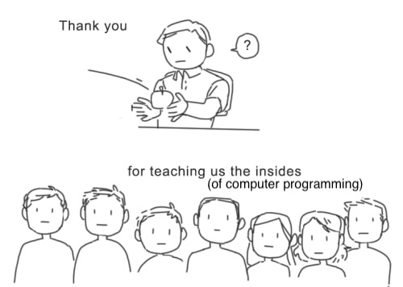

# Final Project Proposal 
## Title: Ushanka’s Despair
 
#### One Sentence Overview: 

"Ushanka's Despair" will be a choose your own adventure game based on the fictional urban legend of Sergey Ushanka, a man who, after finding out he was going to succumb to a life threatening disease, attempted to upload his brain to his computer in order to survive the deterioration of his physical form. 

#### Three Resources 

- [Build Interactive Stories with Ren’Py](https://quickfix.es/2016/05/build-interactive-stories-with-renpy/)
- [Comprehensive Ren'Py Manual](https://www.renpy.org/doc/html/)
- [Quickstart Ren'Py Manual](https://www.renpy.org/doc/html/quickstart.html)
- [Writing Visual Novels with Ren'Py](https://www.renpy.org/dl/4.1/tutorial.html)

(I wrote down four because three of them are from the official Ren'Py website and I felt like it needed to be a bit more varied). 

Also, in the post it said not to write "Youtube" but I don't know if that means no YT links or if it means don't just say "Youtube", so I want to add a couple YT links that I'm going to use just in case you meant that it was alright to put down YT links. Here they are!

- [Ultimate Ren'Py Masterclass](https://www.youtube.com/watch?v=3Lx1gpj6ilU)
- [Lesson Night: Making Visual Novels With Ren'Py](https://www.youtube.com/watch?v=G9o8gHrVCik)
- [Text Messaging in Ren'Py](https://www.youtube.com/watch?v=yNPikwPCfks)

#### One Paragraph Overview 

"Ushanka's Despair" is based on content from the horror anthology podcast *The Magnus Archives*, created under Rusty Quill and licensed under a Creative Commons Attribution-NonCommercial-ShareAlike International License. This means that anyone is free to share it in any medium or format, as well as adapt, remix, transform, and build upon the material given the followng: 

- I must give appropriate credit to the original product
- I must provide a link to the license
- I must provide a link to the original product and indicate if changes were made
- I must not claim nor imply we endorse you or your work
- My work must also have the same creative commons licence applied to it
- My work cannot be used for any commercial purposes
- I cannot apply new legal terms or technological measures that restrict others from accessing the content

[Link to Rusty Quill's Legal Information Here.](https://rustyquill.com/legals/#:~:text=There%20are%20some%20legal%20requirements%20for%20using,that%20restrict%20others%20from%20accessing%20the%20content)

My visual novel will be based on the urban legend of Sergey Ushanka, who is said to have successfully uploaded his brain onto his computer and now interacts with other people via an online chatroom. In *The Magnus Archives*, many programmers try to recreate this illusion in different ways and it is a fun, common challenge within the programming world. In the series, however, this urban legend suddenly becomes real and Ushanka ends up terrorizing many people. I will attempt to recreate this illusion by creating a choose your own adventure game that is set within an ordinary looking chatroom. It will start out pretty normal with an almost boring back and forth and progressively get spookier and spookier. I will try to make it seem like this game is breaking your computer and that things are going terribly wrong and that the user cannot escape the chatroom. This will hopefully be really scary and unnerving. 

#### Will any work as part of this project overlap with any work you are doing outside of this class?

Nope :)

#### In a sentence (or list of features), define a GOOD outcome for your final project. I.e., what WILL you accomplish no matter what?

I will successfully create an interactive visual novel that has a beginning, middle, and end that tells a spooky, interesting story. 

#### In a sentence (or list of features), define a BETTER outcome for your final project. I.e., what do you THINK you can accomplish before the final project's deadline?

I will create an interactive visual novel that has a beginning, middle, and end that tells a spooky, interesting story AND creates the illusion that the player's computer is being manipulated and corrupted on some level. 

#### In a sentence (or list of features), define a BEST outcome for your final project. I.e., what do you HOPE to accomplish before the final project's deadline?

I will create an interactive visual novel that has a beginning, middle, and end that tells a spooky, interesting story AND creates the illusion that the player's computer is being manipulated and corrupted on some level AND has tons of original, spooky art along with a jumpscare at the end. 

#### Outline of steps WITH A SPECIFIC CALENDAR INCLUDING DATES

What I have done already: 

- I have written about half of the dialogue tree on Twine 
- I have created about 7 different creepy pixelated images to be integrated into the game 
- I have accumulated a LOT of resources onto a google doc and made a plan for how I'm going to document everything while I create my game. 

By **November 10th**, I will have gone through all my resources diligently, followed every YT tutorial I can find, and created a couple different drafts of the code for my game on Ren'Py and will have figured out the best way to go about this project. I will also have either finished the dialogue tree, or be at least 85% done with it. 

By **November 17th**, I will have finished the dialogue tree 100% by now and I will have a rough outline of the entire game on Ren'Py. I might not be able to click through the entire game, but I will know what the code will be for each part of the game and have separated it into different sections, along with tutorials to reference for each part. 

By **November 24th**, I will have the ability to click through every prompt and make it to the end of the game, even if the look, "smoothness", charater design etc. isn't there. 

**November 26-30 = Thanksgiving recess** 

By **December 1st**, I will have hopefully finished 95% of the game: I will be able to click through the game and the "look" of the game should be near finished. This is when I can start worrying about creating the illusions of the computer breaking and figuring out the jumpscare. 

By **December 8th**, I will present my game to the class. 

