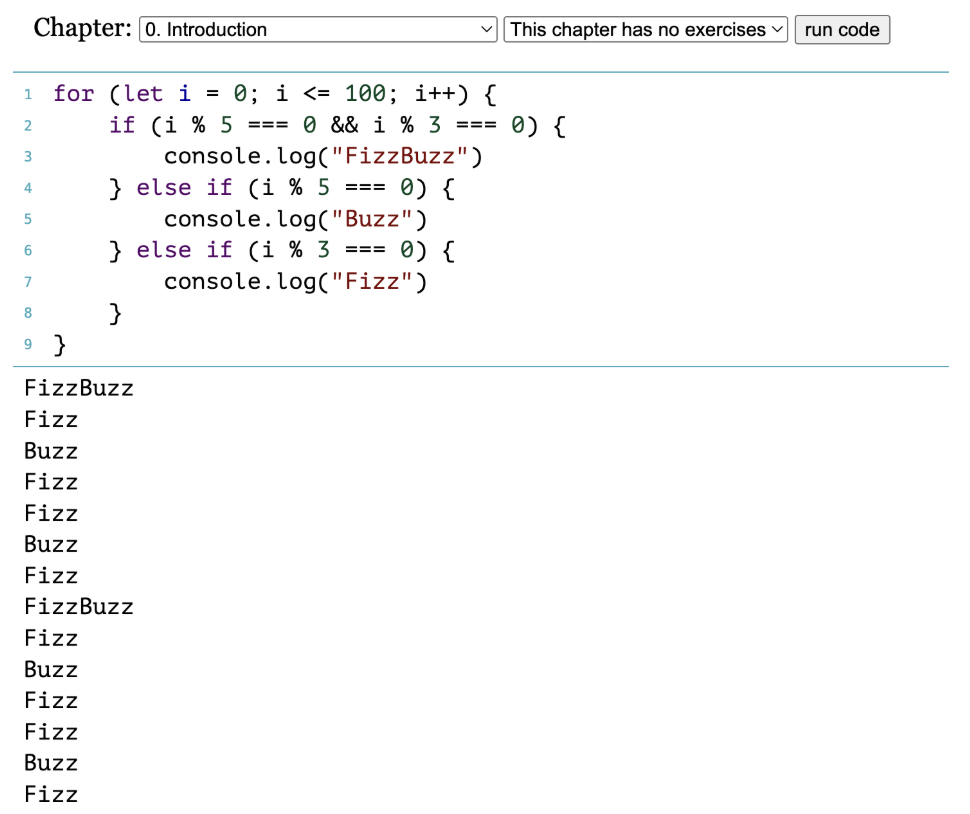
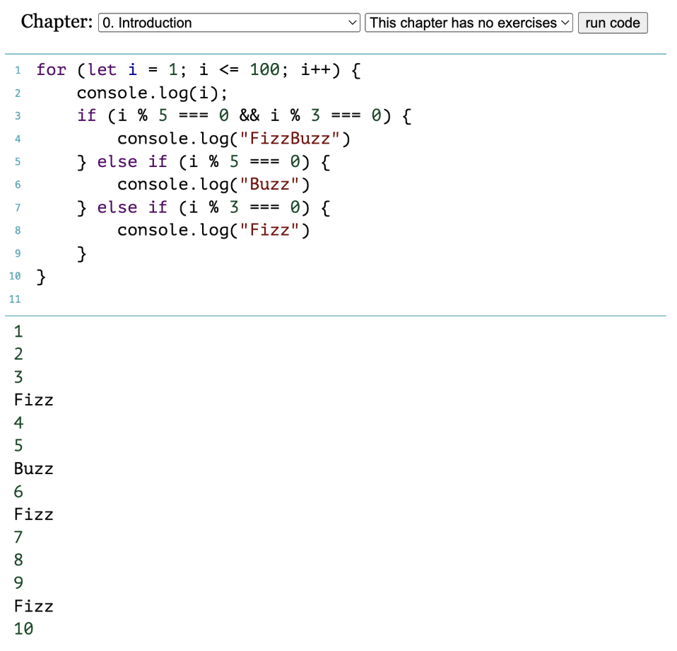
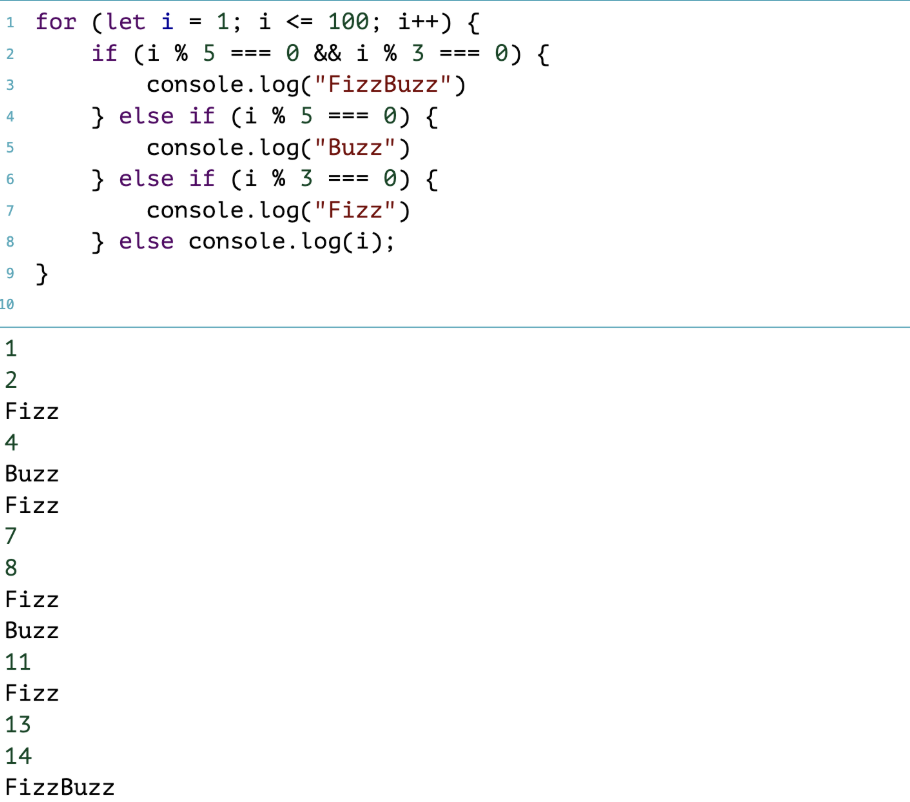

# Homework Week #6 *Supplemental*

### **WOOOOHOOOOOOOOOOOOOOOOO**

#### My winning code: 

`for (let i = 1; i <= 100; i++) {`
	
`if (i % 5 === 0 && i % 3 === 0) {`
		
`console.log("FizzBuzz")`
		
`} else if (i % 5 === 0) {`
		
`console.log("Buzz")`
		
`} else if (i % 3 === 0) {`
		
`console.log("Fizz")`
		
`} else console.log(i);`
	
`}`

This was my first iteration which, as you can see, does not include the very important `else console.log(i)` to make the computer print all numbers that weren't evenly divisible by 3 or 5:

So I realized that I needed to add the command to print all numbers that weren't divisible by 3 or 5 so I added `else console.log(i)` but I inserted it before the Fizz/Buzz/FizzBuzz commands, which gave me this: 

Which makes complete sense since the computer was told to print all the numbers, then do the function again but this time printing Fizz, Buzz, and FizzBuzz, and the end result was that all numbers from 1-100 were printed, but then the extra Fizzs and Buzzs were added following the numbers divisble by 3 and 5. 

Then I realized that I needed to make the computer go through the Fizz/Buzz/FizzBuzz commands THEN tell it to print everything else, which worked!

And that's it for this week :) 

