# The Midterm

Okay this one is going to be a doozy but I'm going to try to keep it short and sweet. 

Also, I didn't have time to make things look pretty which is so unfortunate, but I think I'll make it (just barely). 

####  Phase One 

I wanted to create something:
1. spooky 
2. complicated 
3. based on The Magnus Archives 

Here are my preliminary sketches: 

I eventually landed on my current design, and felt that it would be complicated enough and cool enough for me to be super excited about it. 

#### Phase Two 

I started with the code from the curved grid happy coding tutorial that I used for my curved green lines that form the shape of the eye. You can find the link [here](https://happycoding.io/tutorials/p5js/using-variables/curved-grid). 

##### This was the original code: 

`function setup() {`
	
  `createCanvas(400, 400);`
  
  `strokeWeight(3);`
  
  `stroke(0, 255, 0);`
  
  `noFill();`
  
  `}`

`function draw() {`
	
`  background(32);`

`   // outline`

`   rect(1, 1, width-2, height-2);`

`  // lower-left`

 ` line(0, 0, width * .1, height);`
 
`  line(0, height * .1, width * .2, height);`

 ` line(0, height * .2, width * .3, height);`
 
`  line(0, height * .3, width * .4, height);`

`  line(0, height * .4, width * .5, height);`

`  line(0, height * .5, width * .6, height);`

`  line(0, height * .6, width * .7, height);`

`  line(0, height * .7, width * .8, height);`

`  line(0, height * .8, width * .9, height);`

`  line(0, height * .9, width, height);`

`  // upper-right`

`  line(width * .9, 0, width, height);`

`  line(width * .8, 0, width, height * .9);`

`  line(width * .7, 0, width, height * .8);`

`  line(width * .6, 0, width, height * .7);`

`  line(width * .5, 0, width, height * .6);`

`  line(width * .4, 0, width, height * .5);`

`  line(width * .3, 0, width, height * .4);`

`  line(width * .2, 0, width, height * .3);`

`  line(width * .1, 0, width, height * .2);`

`  line(0, 0, width, height * .1);  `

`}`

I copied and pasted it into the p5.js web editor and immediately started to work on the pupils. I knew I would have to edit the code of the lines at some point, but I wanted to get everything onto p5.js that I wanted to work with to start. 

And guess what- I immediately was having trouble because the parameters :  

`strokeWeight(3);`

`stroke(0, 255, 0);`

`noFill();`

were in the setup function and it was messing with my pupil code. So I took it out of the setup function and put it in the start of the draw function. 

I wanted to reference other code for this circle because I was generally confused on how to make the components not interact with each other (I hadn't extensively used push/pop yet) so I referenced this pre-existing code: 

- [skull p5.js](https://editor.p5js.org/KevinWorkman/sketches/PLk4DH8JH)

- [p5.js website](https://p5js.org/examples/shapes-and-color-shape-primitives/)

##### By this point, I had this as my pupil code: 

`fill(74, 255, 61);`

`noStroke();`

`circle(200, 200, 125);`

I just had a slightly less electric green circle in the middle of my canvas. After this, I fiddled around with the size of the green circle a bunch. I didn't end up creating the black circle for a hot minute since I turned my attention towards the web. 

I spent a good hour trying to find the perfect reference for this web. Eventually, I found [this one](https://editor.p5js.org/dimitym/sketches/xZTgYQI5W), and it was perfect. 

But it took me a long time to go through the code and actually understand what everything meant so that I could alter it. 

##### Here is the code: 

`let bg;`

`let webSpokes = 6;`

`let size = 50;`

`let angle;`

`let scale = [1.19, 1.03];`

`function setup() {`
	
`  createCanvas(400, 400);`

`}`

`function draw() {`
	
`  background(255);`

  
`  push();`

`  translate(width / 2, height / 2);`

  
`  angle = 360 / webSpokes`

  
`  for (let i = 0; i < webSpokes; i++) {`
	
`    strokeWeight(2);`

`    rotate(radians(angle));`

`    line(0, 0, 160, 0);`

`    spiral();`

`  }`

`  pop(); `

`}`

`function spiral(){`
	
`  //how close to the centre do you want to start drawing webs?`

`  let minHeight = 50;`

  
`  //how far out from the centre do you want to draw webs until?`

`  let maxHeight = 220;`

`  //calculates spacing between webs`

`  let increment = 50;`

  
`  //how much to rotate each web so that the arc is aligned with the web angle `

`  let rotateAmount = (angle-90)/2;`

  
`  let scale;`

`  if (webSpokes == 5){`
	
`    scale = 1.19`

`  }`

  
`  if (webSpokes == 6){`
	
`    scale = 1.03`

`  }`

  
`  noFill();`

  
`  //draw multiple webs`

`  for (let l = minHeight; l < maxHeight; l += increment){`
	
`    // calculate vector to move arc to sit between two lines`

`    let v = p5.Vector.fromAngle(radians(angle/2), l);`

    
`    push();`

`    translate(v.x, v.y);`

`    rotate(radians(rotateAmount));`

`    arc(0, 0, l*scale, l*scale, radians(180),` `radians(270));  `

`    pop();`

`  }`

`}`

##### Here are the things I changed: 

- I changed "scale" to "scaleWeb" because it was messing with the term scale in general in p5.js. 
- I changed the size from 50 to 25 to make it smaller 
- originally it said `let angle;` then defined angle later in the code as 360/webSpokes and that didn't make any sense to me so I moved that up, especially since you have to define the term before you bring it up later. 
- I of course got rid of the setup function and background specification since I already had those parameters up top. 
- In the moment, I didn't change the `translate(width / 2, height / 2);` to `translate(400/2, 400/2);` since I didn't realize it would cause problems later down the line, but I did change that eventually.
- I changed the strokeWeight from 2 to 4 since I wanted thicker lines for the spider web. 
- I changed `line(0, 0, 160, 0);` to `line(0, 0, 75, 0);` since I wanted them to be shorter. 
- I changed the minHeight to 25, maxHeight to 125, and increment to 20, since those were the parameters that I thought looked cool. 

Also- I know I'm going in order here, but originally, I tried putting the spider web code before the pupils and background lines code and it took me quite a long time (longer than I'm willing to admit) to realize that I needed to switch the order for things to be layered correctly. 

Here's the point where I made the black pupil. 

`// inner pupil:`

`  fill(0);`

`  noStroke();`

`  circle(200, 200, 42);`

Nothing difficult, but this is the point in time where I started to realise that I needed to be using push/pop to have all the different elements not interact with each other when I don't want them to. For this, I referenced the [midterm github page](https://github.com/rdwrome/261fa25/tree/main/06Midterm).  

It was at this point that I needed to add my text. So I looked up how to do so on the official [p5.js website](https://p5js.org/reference/p5/text/).

It was at this point where I really debated making the text curve with the eye. I decided to move onto the second phase, and once I completed that, I would go back and add the curved text. So at this point, my code looked like this: 

`// text `

`textSize(20);`

`fill(225);`

`stroke(0);`

`strokeWeight(4);`

`text('Look at the sky, Martin...', 30, 100)`

`textSize(20);`

`fill(225);`

`stroke(0);`

`strokeWeight(4);`

`text('...its looking back', 200, 315);`

Two issues: 
1. that was super redundant and I eventually realized that I could just: 

`textSize(20);`

`fill(225);`

`stroke(0);`

`strokeWeight(4);`

`text('Look at the sky, Martin...', 30, 100)`

`text('...its looking back', 200, 315);`

and 2. I wasn't able to add the apostrophe to the it's and that bugged me endlessly. I was not able to figure out a way to add the apostrophe unfortunately. 

With that, I headed onto the next phase. 

#### Phase Three

WOWOOWOWOOWOOWOWOOWOOWOWOW this was diiiiiiiificult. 

I had to take a week long break from this project because I simply could not figure out why this wasn't working. (In the end, I came back to it a week later and within five minutes, I solved it - which honestly was pretty annoying.) 

Here are some fun photos of my attempts to complete phase three: 

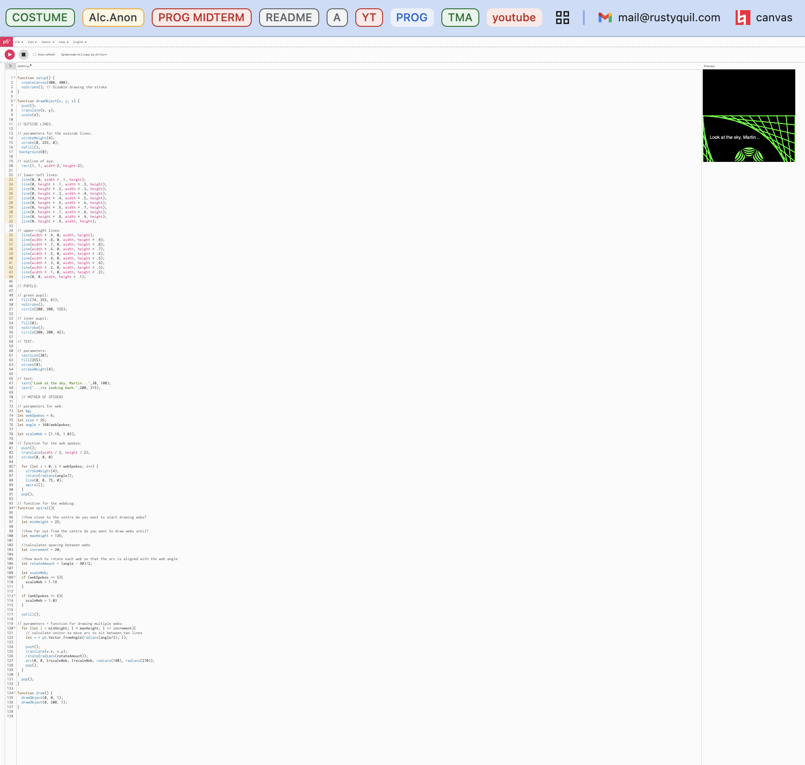

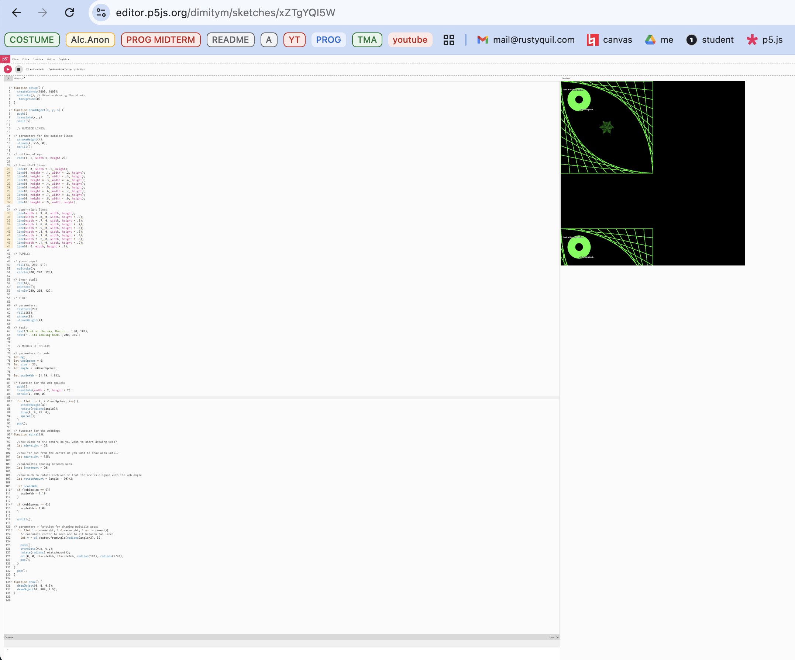

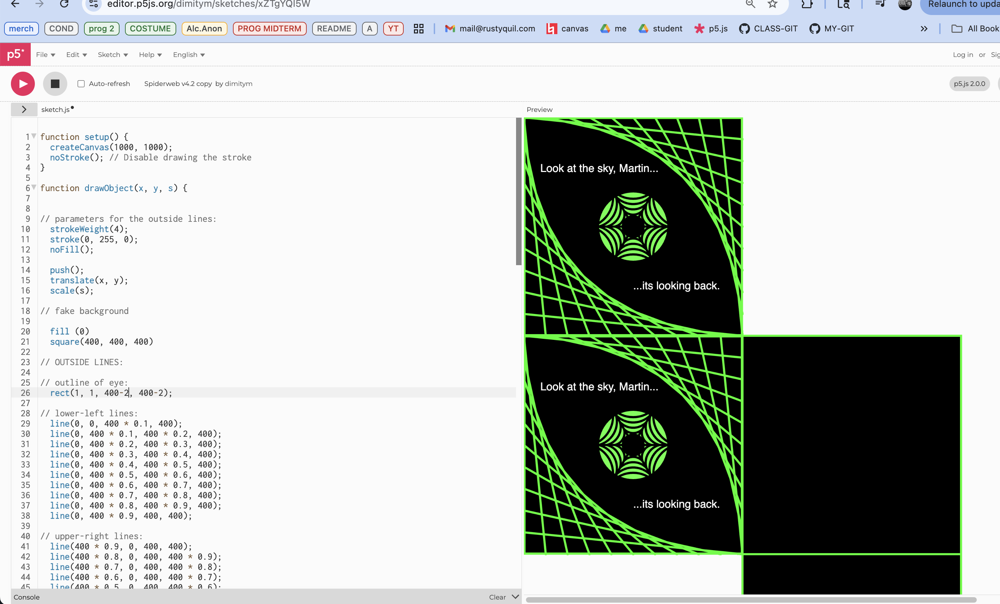

In the end, I needed to change the order of parameters, change the canvas parameters, get rid of the height and width constants and instead use numbers to reflect what I wanted to happen on my canvas, and instead of using the term `background` and defining it through p5.js, I just put a black square behind my drawing and FINALLY, it worked. 

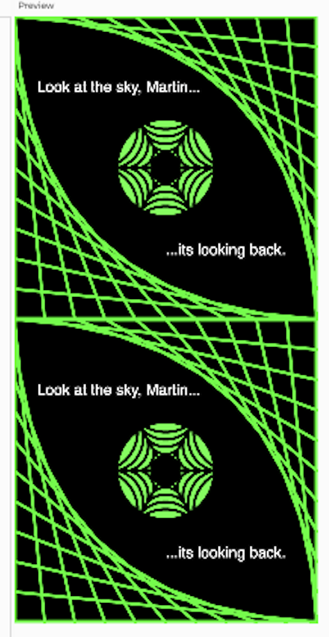

Now, I had my dilemma. Would I go through with making the text follow the shape of the eye? 

I would. 

And so, I was in agony for the next three hours. 

Here are the websites I tried to use: 

- [This is what I started out with, which is crazy, because I didn't even learn how to do the `textAlign (CENTER, CENTER)` for FOREVER and it didn't set me on a good path whatsoever. In fact, this gave me so much false confidence that this was going to be a breeze. How wrong I was.](https://p5js.org/reference/p5/text/)

- [This was pre-existing code that made me realize that I could keep adjusting the angle parameter names so that they were different for each word, and helped me figure out some of the basics. This also filled my stomach with dread.](https://editor.p5js.org/p5/sketches/Typography:_Text_Rotation)

- [This was a forum I came across that sent me on a journey of using `HALF_PI` to try and work out my angles.](https://forum.processing.org/two/discussion/16327/set-text-orientation.html)

- [This was the website where I tried to figure out all the variables for all the different angles and it almost gave me hope -- but oh how stupid, how foolish, how naive I was -- for this was for WebGL and it sent me on a rabbit hole of trying to implement THAT into my code--- which was an absolute train wreck since the whole spider code is based in the regular radians parameters NOT in WebGL anyway](https://p5js.org/reference/p5/rotate/)

- [This was when I fell into that WebGL rabbit hole](https://p5js.org/tutorials/coordinates-and-transformations/). 

- [This made me feel like I was going absolutely insane. It tried to tell me that there was a reason to this hellhole that is the coordinate system on p5.js which is NOT true. And if anyone ever tries to tell me otherwise, I'm leaving the room. Anyway, this sent me on a rabbit hole of trying to use degrees instead of radians.](https://p5js.org/reference/p5/angleMode/) 

I spent so long trying to figure out the rhyme and reason behind the degrees and radians and how things were supposed to be positioned -- I drew nearly 20 different diagrams, looked up everything I could ON DESMOS DUDE -- and every time I thought I had FINALLY figured it out, it would CHANGE ON ME. I-

So anyway, I finally had a basic understanding of how things were supposed to work, and plugged in numbers until I had everything where they needed to be. And I became obsessed with push/pop because I just needed things to stop changing on me when I didn't expect them to. 

I fought tooth and nail for every single piece of that code and I hope it knows that I gaze upon it as if it were a piece of gum beneath my shoe, as if it were a stain on a raggedy old kitchen towel that was SO bad that I decided to THROW IT AWAY. 

So after that, I was done with phase three and I updated phase two to reflect my work. 

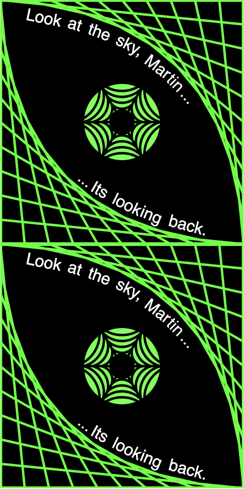

#### Phase Four

Here's where I'm at with phase four: 

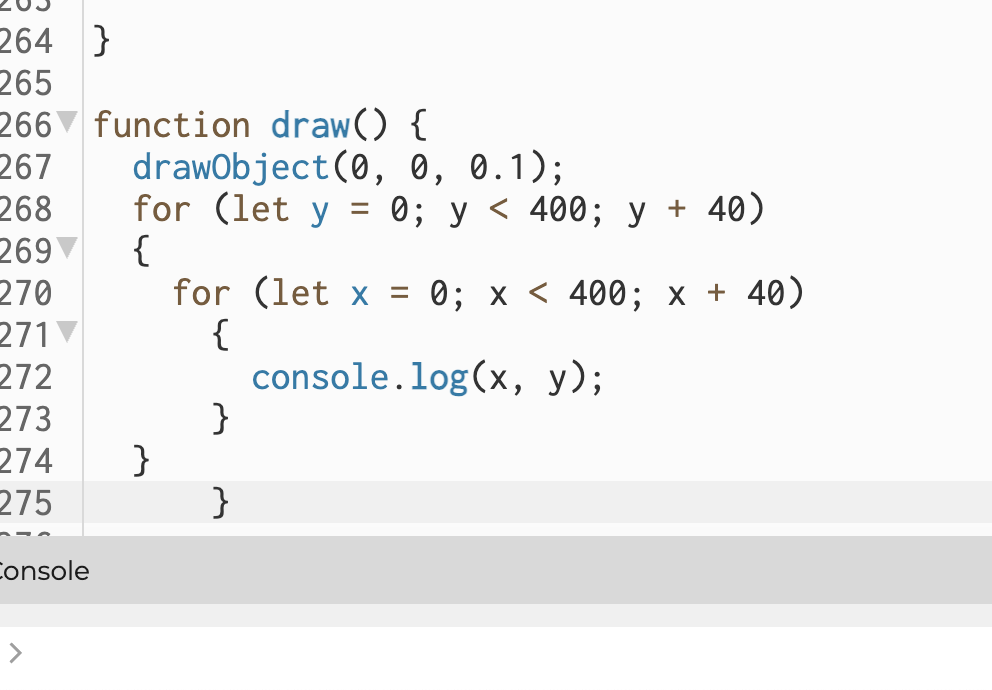

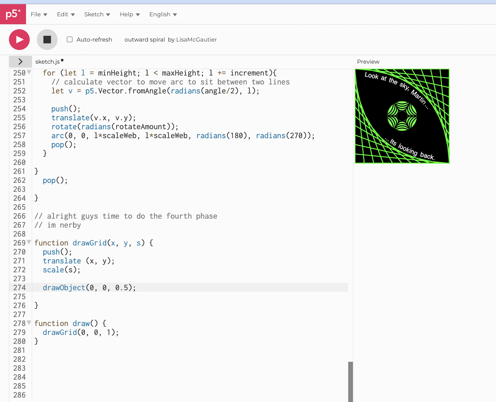

Here are the resources I have been using: 

[Chapter 16 of Eloquent javaScript](https://eloquentjavascript.net/16_game.html). 

[Chapter 17 of Eloquent javaScript](https://eloquentjavascript.net/17_canvas.html). 

[Chapter 2 of Eloquent javaScript](https://eloquentjavascript.net/02_program_structure.html). 

OH MY GOD I ALMOST FORGOT. 

P5.JS CRASHED ON ME AND I ALMOST LOST ALL OF MY CODE FOR ALL THE PHASES ENTIRELY. GUYS I WAS SHITTING BRICKS. 

This was the fatal code that ended it all: 

`function draw() {`
	
`	drawObject(0, 0, 0.1); `

`	for (let y = 0; y < 400; y + 40)`

`	{ `
	
`		for (let x = 0; x< 400; x + 40)`

`		{`
	
`			console.log (x,y);`

`		}`

`}`

`      }`

but I think I'm on the right track.

I haven't figured it out as of Sunday night, but I will keep updating this ReadMe. 

### GUYS
### ITS 7:50AM AND I DID IT 
### I FIGURED IT OUT ON THE GREEN LINE 

OH MY GOD

Here were my steps: 

I googled it cause i forgot that was an option ( I have been severely sleep deprived )

found this:

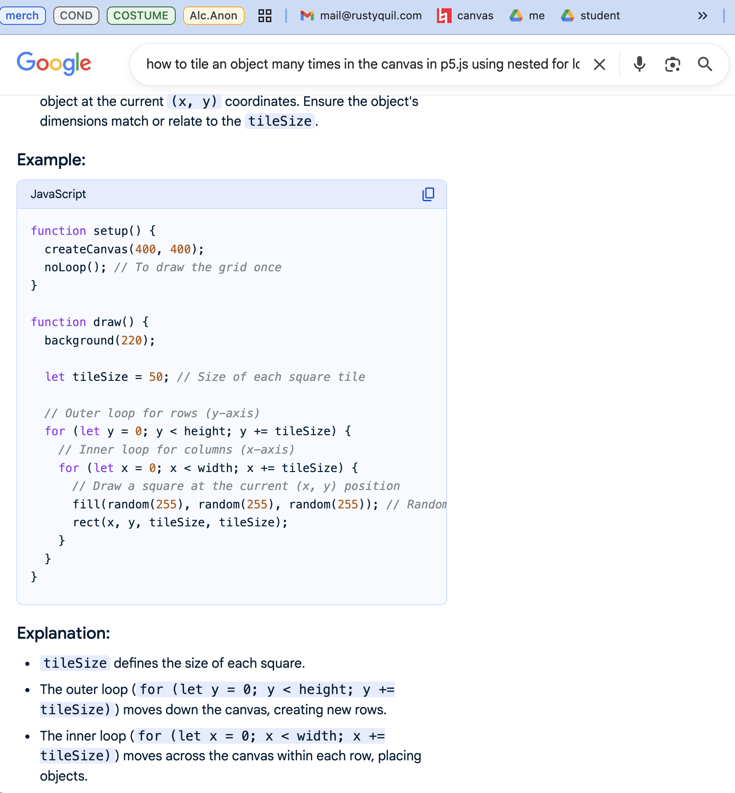

then plugged it into p5.js 

##### Got this: 

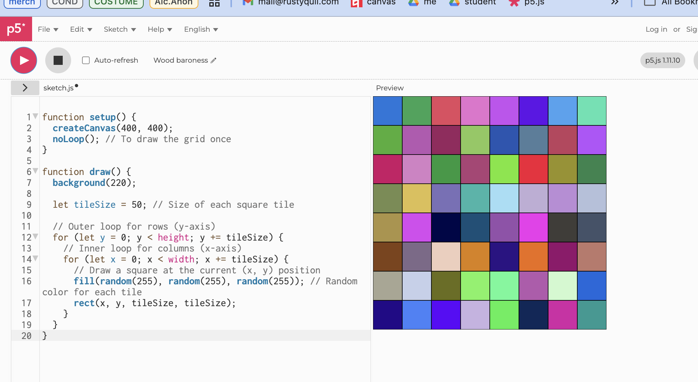

Tried to translate the basics of that formula into this project: 

`// alright guys lets try this one again`

`// steps: added noLoop(); up top to make it draw the grid once only`

`function draw {`
	
`let tileSize = 40;`

`for (let y = 0; y < 400; y += tileSize) i`

`for (let x = 0; x < 400; x += tileSize) {`
	
`drawObject (x, y)`

`}`

`}`

`}`

but I came up with this: 

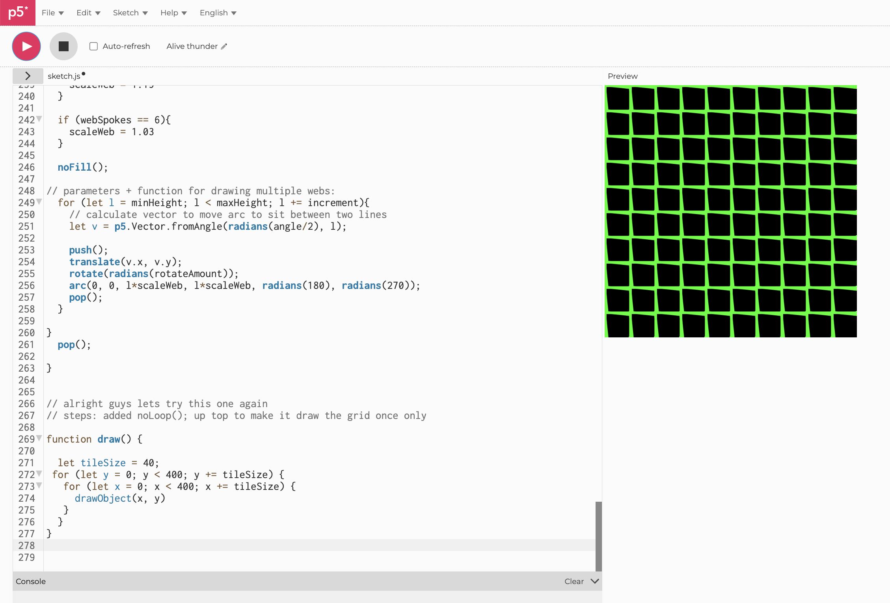

Then I looked up how to do it on the [official p5.js website.](https://p5js.org/reference/p5/for/)

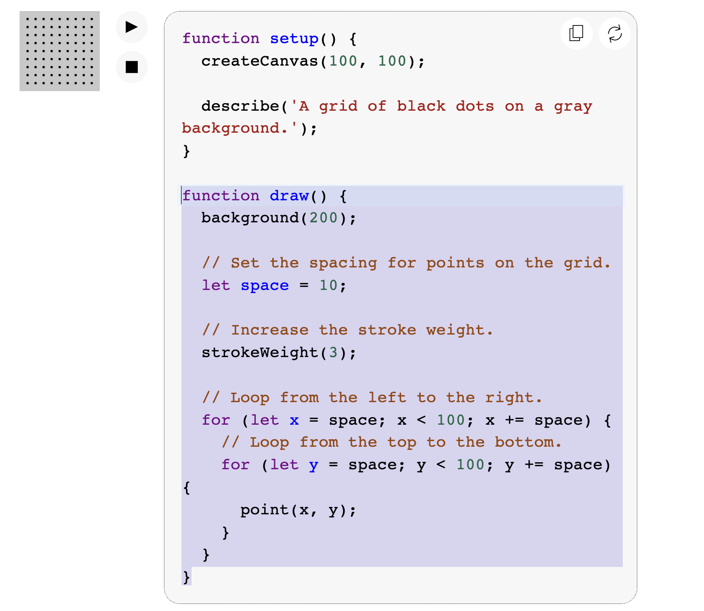

##### Got to this code: 

`function draw {`
	
`let tileSize = 40;`

`for (let y = 0; y < 400; y`

`+= tileSize) {`
	
`for (let x = 0; x < 400; x += tileSize) {`
	
`drawObject(x, y, tileSize, tileSize);`

But I only got a green square. 

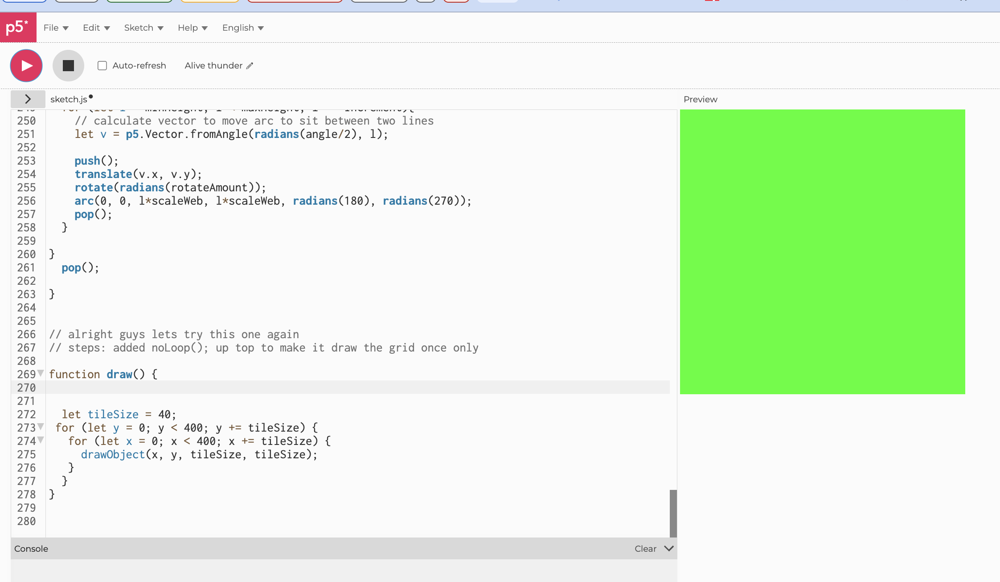

Then I found [this youtube video (timestamp 3:38).](https://www.youtube.com/watch?v=G_vKebvhpa0)

that held the code: 

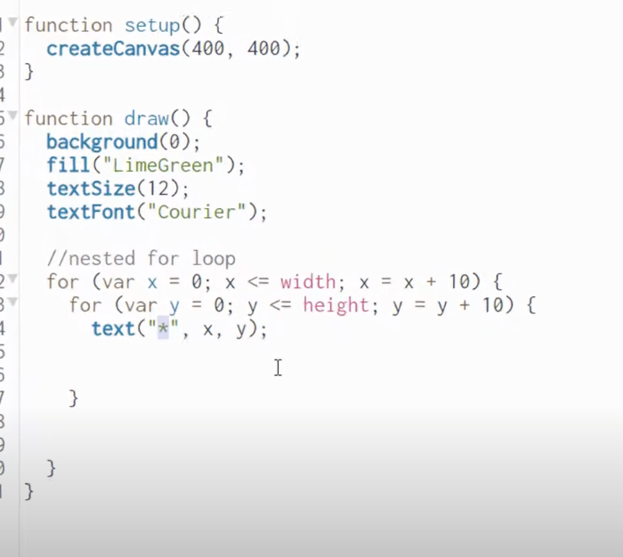

##### Tried to translate it into my project and got this: 

`function draw() {`
	
`for (let x = 0; x`

`< 400; x= x + 40) 1`

`for (let y = 0; y`

`<= 400; y = y + 40) 1`

`for (let s = 0; s <= 400; s= s + 40) {`
	
`drawObject (x, y, s);`

__AND I FORGOT TO ADD THE noLoop(); UP TOP AND P5.JS STARTED CRASHING BUT I SAVED IT OH MY GOD__

Then I added the no loop and got a green square again, so my anxiety wasn't even for anything 

Then I kept playing around with things since I felt like I knew the basic principles: 

`function draw) {`
	
`let tileSize = 40`

`let s = tileSize`

`for (let y = 0; y < 400; y += tileSize) {`
	
`drawObject (y, 40, 40)`

`}`

`for (let x = 0; x < 400; x += tileSize) {`
	
`drawObject(x, 40)`

`}`

Then I got this: 

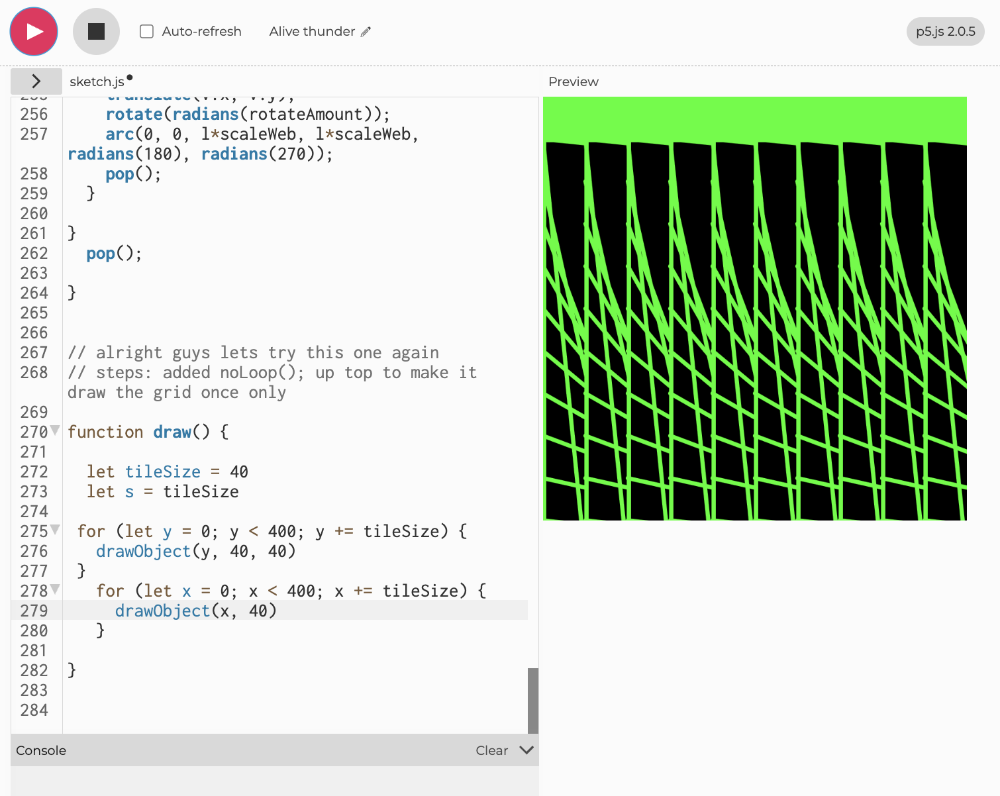

AND THEN I WENT. 

wait.

### I'VE ALREADY BEEN ABLE TO DO THE DRAW OBJECT AT ANOTHER LOCATION. 

THE HARD PART WAS THE FOR LOOPS. 

I ALREADY FIGURED THIS OUT. 

So I went back to my phase 3 code and SURE ENOUGH I ALREADY FIGURED IT OUT. 

it was the scale variable that I was just completely misusing (again- sleep deprived over here)

`function draw() {`
  
`  let tileSize = 40 `

`  let s = scale`
  
` for (let y = 0; y < 400; y += tileSize) {`
	
`   for (let x = 0; x <= 400; x += tileSize) {`
	
`   drawObject(x, y, 0.1)`

`   }`
 
`  }`
  
`}`

**AND**
**IT** 
***WORKED***

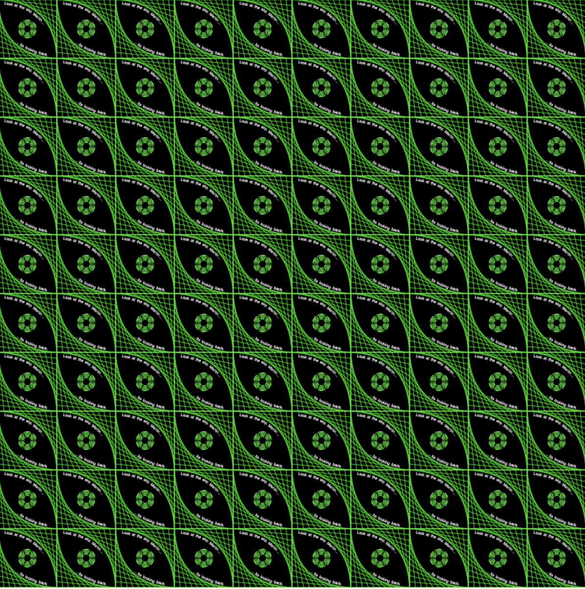

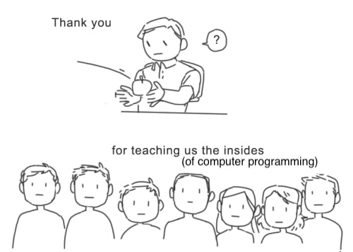